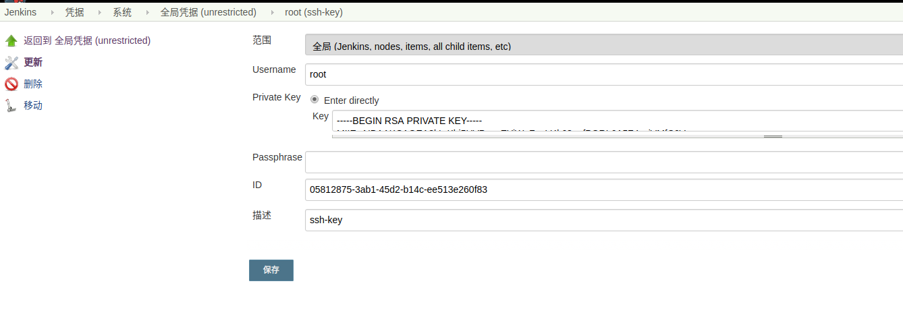
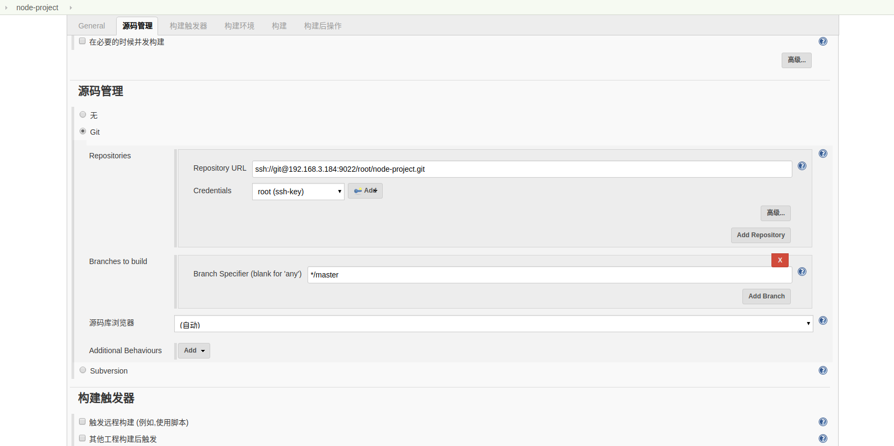
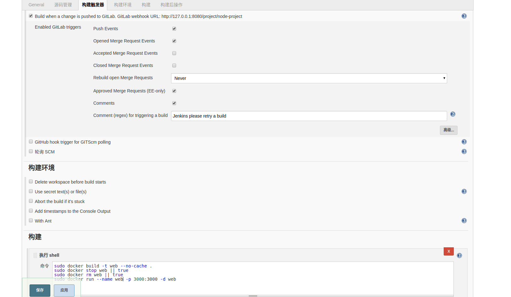
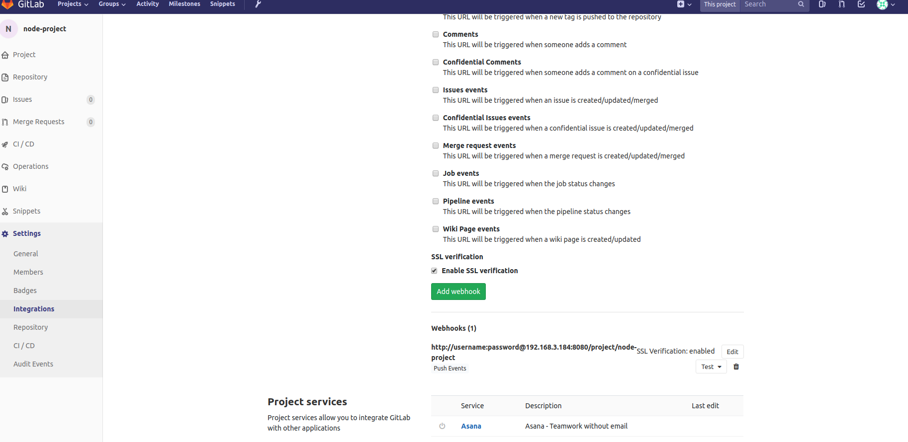
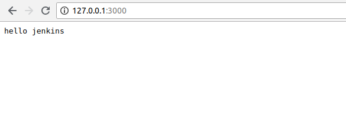
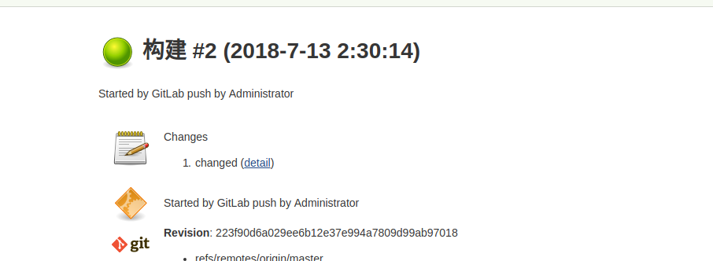
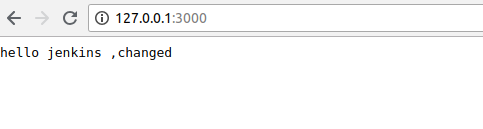

# 使用 docker + jenkins + Gitlab 构建自动集成环境
## install Jenkins
`sudo docker build -t jenkins_sudo .`

```
sudo docker run \
  -u root \
  --name jenkins \
  -d \
  -p 8080:8080 \
  -v /home/jenkins:/var/jenkins_home \
  -v $(which docker):/usr/bin/docker \
  -v /usr/lib/x86_64-linux-gnu/libltdl.so.7:/usr/lib/x86_64-linux-gnu/libltdl.so.7 \
  -v /var/run/docker.sock:/var/run/docker.sock jenkins_sudo
```
### 添加认证

### 配置Jenkins


## install Gitlab
```
sudo docker run -d \
    --name gitlab\
    -p 443:443 \
    -p 80:80 \
    -p 9021:22 \
    -v /home/gitlab/config:/etc/gitlab \
    -v /home/gitlab/logs:/var/log/gitlab \
    -v /home/gitlab/data:/var/opt/gitlab \
    gitlab/gitlab-ce
sudo docker run -d \
  --name gitlabee \
  -p 9443:9443 \
  -p 9080:9080 \
  -p 9022:22 \
  -v /home/gitlab-ee/config:/etc/gitlab \
  -v /home/gitlab-ee/logs:/var/log/gitlab \
  -v /home/gitlab-ee/data:/var/opt/gitlab \  gitlab/gitlab-ee
```
### allow local web hook
`curl -X PUT --header "PRIVATE-TOKEN: XXXXXXXXXXXXXXXXXXXX" 'http://sample.gitlab.com/api/v4/application/settings?allow_local_requests_from_hooks_and_services=true'`
### 在项目中添加Jenkins中的webhook

这里需要点击测试，正确的是提示200(url 需要加上用户名和密码)

## 自动构建

### 结果

## 更新后构建

### 结果
