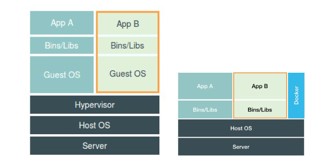

# docker
## install 
- REF: https://docs.docker.com/install/linux/docker-ce/ubuntu/
## install
```
sudo apt-get update
apt-get install \
    apt-transport-https \
    ca-certificates \
    curl \
    software-properties-common

curl -fsSL https://download.docker.com/linux/ubuntu/gpg | sudo apt-key add -

sudo apt-key fingerprint 0EBFCD88

sudo add-apt-repository \
    "deb [arch=amd64] https://download.docker.com/linux/ubuntu \
    $(lsb_release -cs) \
    stable"

sudo apt-get update

sudo apt-get install docker-ce
```
## install proxy
## use Proxy
`vi /lib/systemd/system/docker.service`  
在`[Service]`中添加你的代理服务器地址
```
Environment=HTTP_PROXY=http://127.0.0.1:8123/
Environment=HTTPS_PROXY=http://127.0.0.1:8123/
Environment=NO_PROXY=localhost,127.0.0.1
```
## install k8s
```
apt-get update && apt-get install -y apt-transport-https curl
curl -s https://packages.cloud.google.com/apt/doc/apt-key.gpg | apt-key add -
cat <<EOF >/etc/apt/sources.list.d/kubernetes.list
deb https://apt.kubernetes.io/ kubernetes-xenial main
EOF
apt-get update
apt-get install -y kubelet kubeadm kubectl
apt-mark hold kubelet kubeadm kubectl
```
# Docker 的本质

Docker 实际上是对 Linux `namespace`,`Cgroups`,以及 `rootfs`的一种使用  
容器其实也是一种`进程`运行在宿主机中! 只是不一样的是在容器内部只能看到在当前容器内运行的进程(`namespace` 隔离),以及可以使用`Cgroups`去限制容器运行的资源,最后使用`rootfs` 做文件系统。
但是容器在功能单位中有着很好的粒度优势 '一个容器只运行一个进程，一旦进程退出则容器退出'，  
那么传统方式部署的监控,日志收集,数据备份等工作都可以被分开成多个镜像.  
- 把多个程序的日志统一挂载到一个`volume`中,在另一个日志推送的`filebeat`容器中挂载这个`volume` 中进行推送到日志服务器.
- 备份同理
TODO:
- 监控 Prometheus 

REF: [酷壳 Linux namespace](https://coolshell.cn/articles/17010.html)  
REF: [极客时间 左耳听风](https://time.geekbang.org/column/article/11665)  
REF: [极客时间 深入剖析 kubernetes](https://time.geekbang.org/column/116)
## awesome docker
https://github.com/veggiemonk/awesome-docker
## 最佳实践
[docker 官方最佳实践](https://docs.docker.com/develop/develop-images/dockerfile_best-practices/)  
[github 收集的各个地方的使用 Docker 的建议和实践。
](https://github.com/FuriKuri/docker-best-practices)  
[容器化应用程序的架构、创建和管理的协作型文档项目。
](http://docs.projectatomic.io/container-best-practices/)  

[八个 Docker 的开发模式](http://hokstad.com/docker/patterns)
## 基础的一些东西
### WORKDIR 
指定工作目录(如果目录不存在则建立目录 root 用户创建！！！)
### USER
指定当前用户以及之后的镜像层使用的用户

### COPY
```
COPY [--chown=<user>:<group>] <src>... <dest>
COPY [--chown=<user>:<group>] ["<src>",... "<dest>"] 
COPY --chown=55:mygroup files* /somedir/
COPY --chown=bin files* /somedir/
COPY --chown=1 files* /somedir/
COPY --chown=10:11 files* /somedir/
```
### EXPOSE
`EXPOSE` 对应是在 `docker run -P  `  
`docker run -p 80:3000`
docker `3000` 端口到 宿主机`80` 端口
### RUN
`RUN` 有两种执行方式
1. `RUN ls -la`
2. `RUN ["/bin/ls","-l","-a"]`
### CMD
CMD 一个dockerfile 只有一个CMD 
HEALTHCHECK  --interval=5m --timeout=3s \
  CMD wget --quiet --tries=1 --spider http://localhost:3000 || exit 1
## Docker compose
### install docker compose
```
sudo curl -L "https://github.com/docker/compose/releases/download/1.23.1/docker-compose-$(uname -s)-$(uname -m)" -o /usr/local/bin/docker-compose

chmod +x /usr/local/bin/docker-c
```