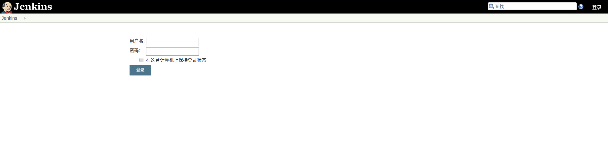

# Jenkins
## install 
### ubuntu 18.04 
1. install java 8 cause Jenkins still use Java 8
```
sudo add-apt-repository ppa:webupd8team/java
sudo apt install oracle-java8-installer
```
2. add Jenkins's signing key and repository
```
wget -q -O - https://pkg.jenkins.io/debian-stable/jenkins.io.key | sudo apt-key add -

```
3.  install stable Jenkins server

```
sudo apt-add-repository "deb https://pkg.jenkins.io/debian-stable binary/"
```
4.  `sudo apt-get update && sudo apt-get install jenkins -y`
5.  navigate your browser to url: http://jenkins-ubuntu:8080
6.  sudo cat /var/lib/jenkins/secrets/initialAdminPassword 
  


## docker
### 获取`jenkins` 镜像
`sudo  docker pull jenkins`
### 运行 `jenkins`
```
sudo docker run \
-u root \
--name jenkins \
-d \
-p 8080:8080 \
-v /home/jenkins:/var/jenkins_home \
jenkins
```
## 获取初始密码
1. `sudo docker exec jenkins cat /var/jenkins_home/secrets/initialAdminPassword`       
2. `cat /home/jenkins/secrets/initialAdminPassword` 
  