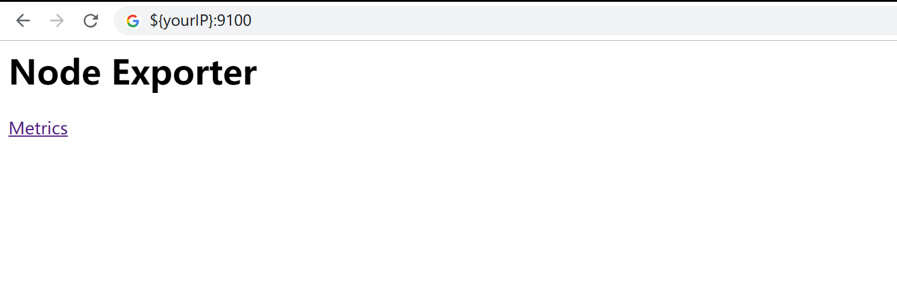

# 安装
1. 下载`node_exporter`: `curl -O https://github.com/prometheus/node_exporter/releases/download/v0.17.0/node_exporter-0.17.0.linux-amd64.tar.gz`
2. 创建service:
  - `useradd -rs /bin/false node_exporter`
  - `mv node_exporter-0.16.0.linux-amd64/node_exporter /usr/local/bin/`
  - vi `/etc/systemd/system/node_exporter.service`

    ```
      [Unit]
      Description=Node Exporter
      After=network.target

      [Service]
      User=node_exporter
      Group=node_exporter
      Type=simple
      ExecStart=/usr/local/bin/node_exporter --collector.tcpstat

      [Install]
        WantedBy=multi-user.target
      ~
    ```
  -  `systemctl daemon-reload`
  - `service node_exporter start`

